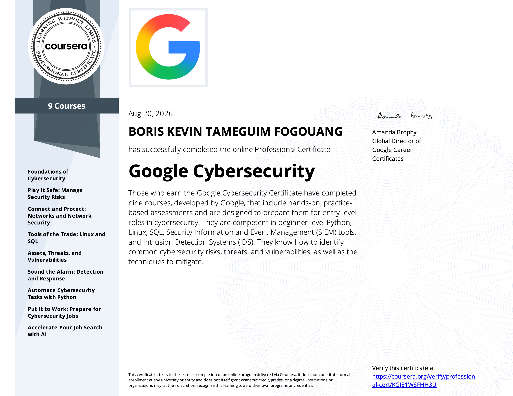

<h1>Hi, I'm Boris!  <a <a href="https://www.linkedin.com/in/boriskt/">Cybersecurity Professional</a>

## SOC analyst and cybersecurity professional in Montreal, Quebec | 5 years of IT support experience | Working toward Security+ | Splunk, Sentinel, Active Directory | EN/FR

# 👨‍💻 Cybersecurity Home Lab Portfolio

Hands-on SOC analyst home labs demonstrating practical skills in security monitoring, incident triage, network analysis, Linux administration, identity management, and help-desk support.

## Projects

| # | Project | Skills Demonstrated | Status |
|---|---------|---------------------|--------|
| 1 | [UTM SOC Home Lab - Kali + Windows](https://github.com/Boris-Tameguim/utm-kali-windows-home-lab) | Virtualization, ARM64 systems, IP networking, routing, Windows Firewall troubleshooting | ✅ Complete |
| 2 | [MyFirstHack Internship - SOC Track](https://github.com/Boris-Tameguim/myfirsthack-soc-track) | SOC monitoring, alert triage, incident investigation, security operations | In progress |
| 3 | [SIEM Lab (Wazuh)](https://github.com/Boris-Tameguim/wazuh-siem-lab) | Log ingestion, SIEM administration, endpoint monitoring | In progress |
| 4 | [Help Desk Ticketing (osTicket + Docker)](https://github.com/Boris-Tameguim/osticket-docker-helpdesk-lab) | Ticket lifecycle management, containerization | In progress |
| 5 | [Packet Capture (Wireshark)](https://github.com/Boris-Tameguim/wireshark-packet-analysis-lab) | Network traffic analysis, protocol identification | In progress |
| 6 | [Apache Web Server (Linux)](https://github.com/Boris-Tameguim/apache-linux-web-server-lab) | Linux administration, service troubleshooting | In progress |
| 7 | [Identity Management (Entra ID)](https://github.com/Boris-Tameguim/entra-id-identity-management-lab) | IAM, user/group/permission administration | In progress |

## About
Built as part of a self-directed home lab program to turn theoretical coursework into demonstrable, hands-on experience. Each project repository contains a write-up covering the objective, tools, steps performed, troubleshooting, key takeaways, and screenshots.

# 📝 Certifications

  
  

- **Google IT Support Professional Certificate**  
IT troubleshooting, networking, operating systems, system administration, and customer support.

- **Google Cybersecurity Professional Certificate**  
Cybersecurity foundations, Linux, SQL, SIEM concepts, incident response, and network security.

- **GRC Mastery** 
Governance, risk management, compliance, security controls, and risk assessment.

- **CompTIA Security +** (In progress)

# 🤳 Connect with me:

- LinkedIn: https://www.linkedin.com/in/boriskt/
